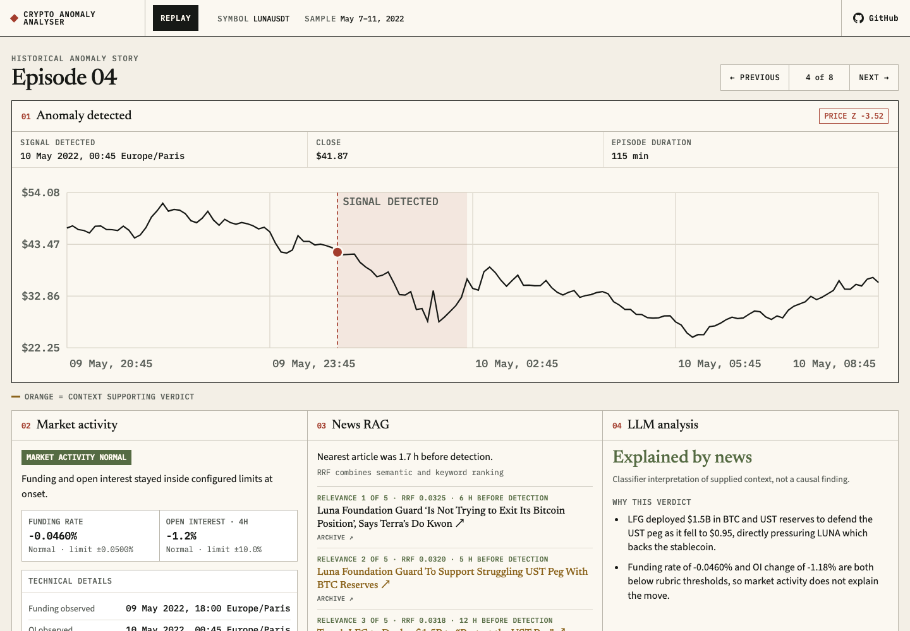
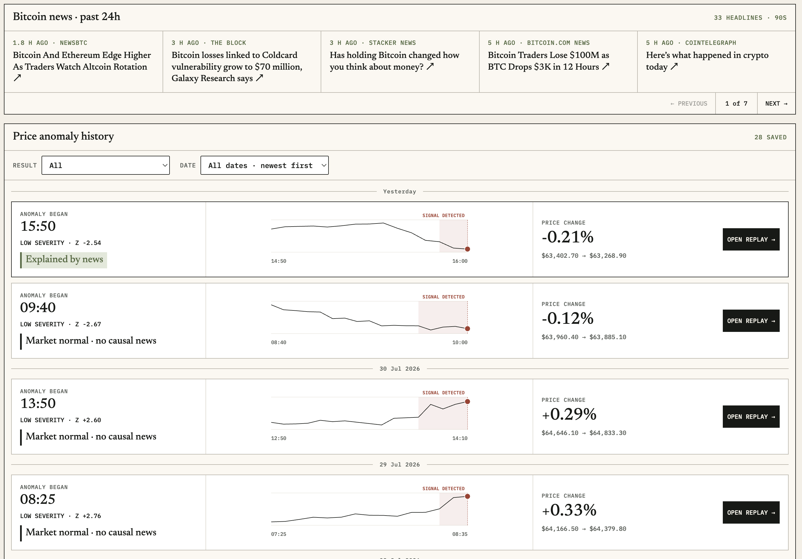

# Crypto Anomaly Analyser

Detects crypto price anomalies, captures market and news context available at detection time, and compares LLM explanations across isolated evidence modes.

## Demos

### Historical LUNA case study

Eight LUNAUSDT episodes from May 7-11, 2022, classified with derivatives-only, news-only, and combined context.

**[Open the LUNA crash evidence workbench](https://zeng-zer.github.io/crypto-analyser/)**

[](https://zeng-zer.github.io/crypto-analyser/?onset=1652136300000)

### Live BTCUSDT analysis

Streams closed five-minute bars, detects anomalies, analyses supporting context, and saves episodes for replay.

**[Open the live BTCUSDT anomaly analyser](https://zeng-zer.github.io/crypto-analyser/live.html)**

[](https://zeng-zer.github.io/crypto-analyser/live.html)

## Pipeline

```text
Binance market data + Alternative.me daily Fear & Greed
  -> anomaly detection
  -> onset-safe derivatives, sentiment, and news context
  -> derivatives-only, news-only, and combined classifications
  -> Ragas Faithfulness check
  -> saved episode replay
```

An **unexplained** episode has neither unusual derivatives activity nor credible retrieved news. This outcome supports investigation; it does not prove that price moved before a public explanation appeared.

## Docker quickstart

Requirements: Docker Compose and an OpenAI-compatible chat and embedding API.

```bash
cp .env.example .env

# Replace placeholder passwords, API credentials, and model names in .env.
docker compose up -d --build app pgvector
curl --fail http://127.0.0.1:8000/healthz
```

Open `http://127.0.0.1:8000/live.html` for live observation. Public news fallback is intentionally limited, but enough to exercise the workflow.

Stop services with:

```bash
docker compose down
```

PostgreSQL data remains in the `pgvector_data` Docker volume.

## Development

```bash
uv sync --locked
uv run pytest -q
uv run ruff check .
```

Refresh committed historical visual data after generating new pipeline results:

```bash
uv run python scripts/build_visual_data.py
```

## Architecture

| Component | Role |
|---|---|
| Binance HTTP and WebSocket APIs | Historical and live market data |
| PostgreSQL with pgvector | News embeddings and saved live episodes |
| OpenAI-compatible API | Embeddings, classification, and faithfulness judging |
| Python backend | Detection, retrieval, analysis, persistence, and SSE |
| GitHub Pages | Historical and live browser interfaces |

Browser renders server state. Credentials and analysis remain in backend.

## Scope

Historical milestone covers one LUNA crash window. It produced eight episodes and 24 classifications across three evidence modes. Results show evidence overlap in this case, not general source superiority or proof of causality.

## Documentation

- [CONTEXT.md](CONTEXT.md): domain language and classification outcomes
- [docs/storage.md](docs/storage.md): storage design
- [docs/adr/](docs/adr/): architecture decisions

## Contributors

- [Luc Zhang (@luckk11)](https://github.com/luckk11): PostgreSQL news schema, embedding and indexing workflow, vector retrieval prototype, and time-bounded RAG retrieval
